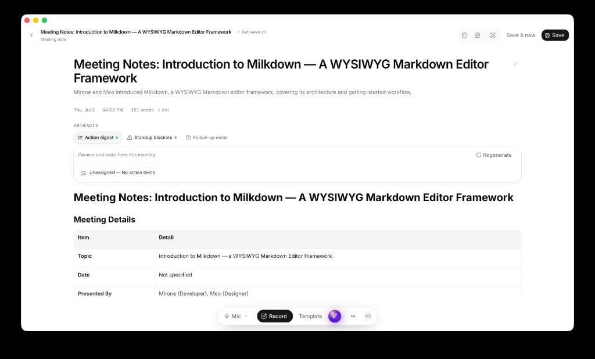

# Myna Notes

Local meeting notes for macOS. Live transcription runs **on this Mac** (Apple Neural Engine). Optional AI polish uses **your** API key only when you Enhance or chat.

**Version:** 0.1.0



## Why Myna Notes

1. **Live captions** — mic, system audio (other side of a call), or both  
2. **Enhance** — structured notes, action digests, concept **tags**  
3. **Weekly review** — Actions, People, and tag filters across the month  
4. **Privacy-first** — ASR stays local; cloud AI is opt-in  

## Features

- **On-device ASR** — Parakeet v3 via [FluidAudio](https://github.com/FluidInference/FluidAudio) Core ML  
- **Speaker diarization** — FluidAudio offline pyannote/VBx pipeline after stop or audio import (`Speaker 1:` …)  
- **System audio capture** — Core Audio process tap (macOS 14.4+); dual mode labels `Me:` / `Them:`  
- **Dual-pane notepad** — shorthand + live transcript; Enhance merges both  
- **Concept tags** — multi-label topics; AI can auto-tag after Enhance  
- **Actions & People** — open loops and memory from enhanced notes  
- **Calendar** — upcoming EventKit events, one-click start with attendees  
- **Dictionary** — teach spellings; known people names are protected from bad rewrites  
- **Recipes & share** — follow-up email, digests; mailto / export / Slack  
- **Local MCP** — optional snapshot for Cursor/Claude  

## Requirements

- macOS 14+ (Apple Silicon recommended; Fluid sidecar ships `aarch64-apple-darwin`)  
- Xcode CLT for building the sidecar  
- Optional: AI API key for Enhance / chat (DeepSeek, OpenAI, Anthropic, xAI/Grok, Gemini, Groq, OpenRouter, Ollama, or custom)  

## Develop

```bash
yarn install
yarn tauri:dev
```

Build release DMG:

```bash
yarn tauri:build
```

See **[LAUNCH.md](./LAUNCH.md)** for signing, notarization, and ship checklist.

## Local MCP

1. Settings → Meeting → enable **MCP snapshot**  
2. `cd mcp-server && cargo build --release`  
3. Point your MCP client at the binary + `MEETING_NOTES_SNAPSHOT` path (Settings → Share shows the data dir)  

Tools: `list_meetings`, `get_meeting`, `search_meetings`, `list_folders` (tags), `list_open_actions`, `get_brief`.

## Architecture

```
React UI (Vite)  ◄── events / invokes ──►  Tauri (Rust)
                                              │
                                         fluidasr (Swift)
                                         Parakeet + mic/system tap
```

- `src/` — React app  
- `src-tauri/` — shell, capture, calendar, MCP snapshot  
- `fluid-sidecar/` — streaming ASR binary  

## Privacy

| Data | Where |
| --- | --- |
| Audio → text | On-device ASR only |
| Notes, tags, people | Local storage on this Mac |
| Enhance / chat | Your AI provider, only with a configured key |

## License

Private / as distributed by the author.
