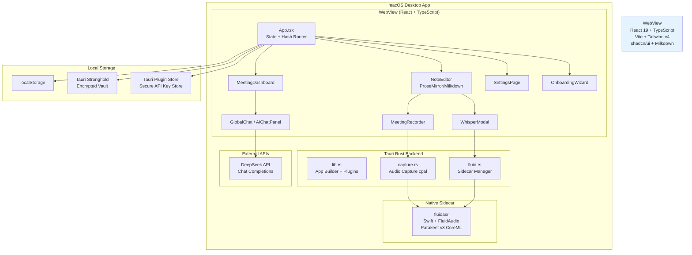
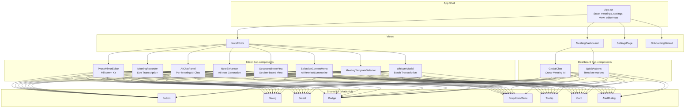
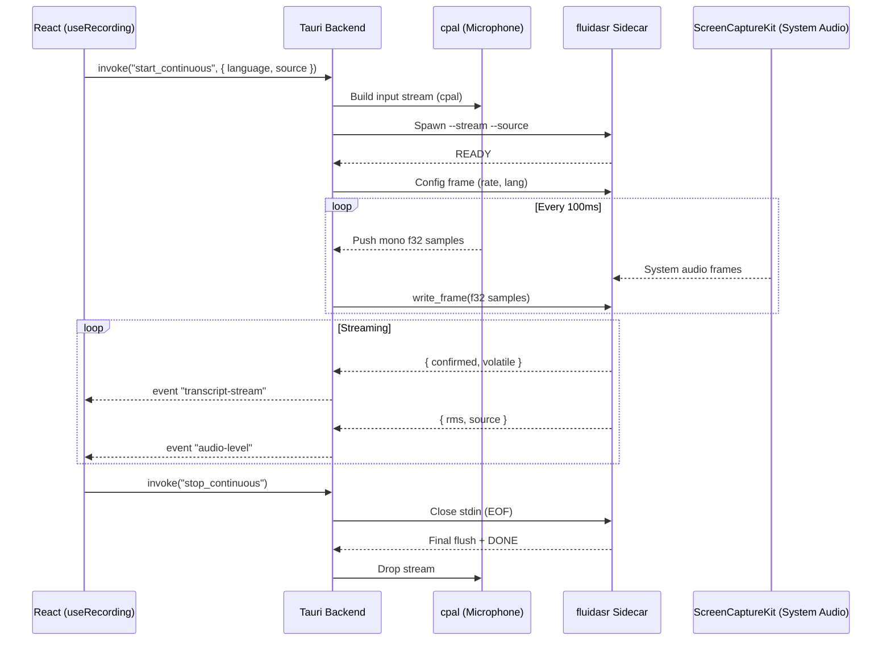
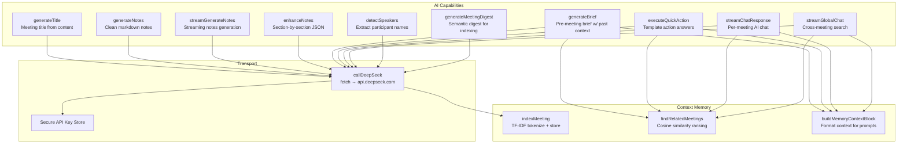
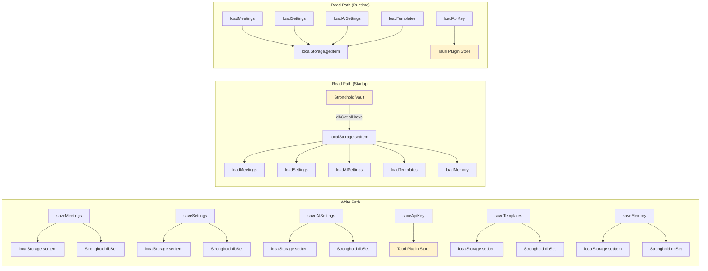
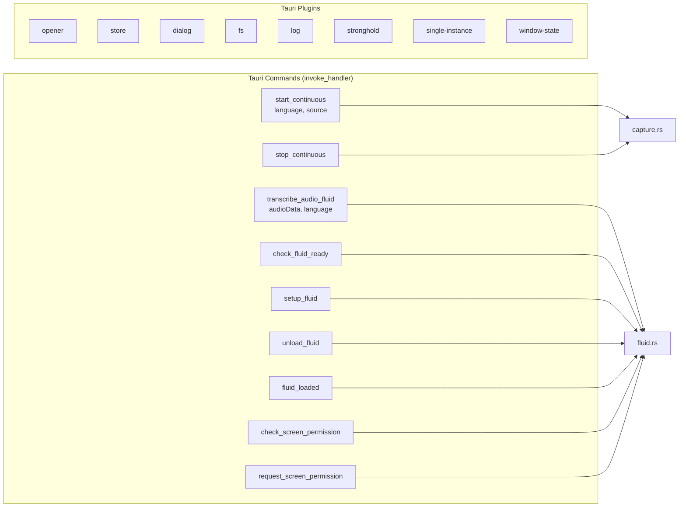
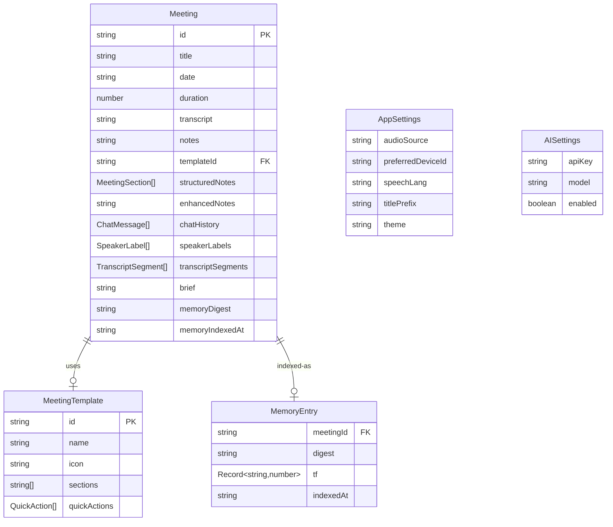

# Myna Notes — Architecture

## System Overview



## Frontend Component Architecture



## Recording & Transcription Pipeline



## AI Service Architecture



## Storage Architecture



## Backend Invoke Commands



## Data Model



## File Map

```
meeting-notes/
├── src/                          # React frontend
│   ├── App.tsx                   # Root state, hash routing, view switching
│   ├── main.tsx                  # React DOM entry point
│   ├── types.ts                  # All TypeScript interfaces & constants
│   ├── index.css                 # Tailwind v4 imports
│   ├── components/
│   │   ├── meeting-dashboard.tsx # Meeting list, search, sort, global chat
│   │   ├── note-editor.tsx       # Editor shell (recorder + prose + chat)
│   │   ├── ProseMirrorEditor.tsx # Milkdown/ProseMirror markdown editor
│   │   ├── meeting-recorder.tsx  # Live recording UI + controls
│   │   ├── ai-chat-panel.tsx     # Per-meeting AI chat sidebar
│   │   ├── global-chat.tsx       # Cross-meeting AI search
│   │   ├── note-enhancer.tsx     # AI note generation dialog
│   │   ├── structured-note-view.tsx # Section-based note display
│   │   ├── selection-context-menu.tsx # AI rewrite/summarize selection
│   │   ├── whisper-modal.tsx     # Batch audio transcription
│   │   ├── settings-page.tsx     # Settings UI
│   │   ├── onboarding-wizard.tsx # First-run setup
│   │   ├── meeting-detail-page.tsx # Detailed meeting view
│   │   ├── meeting-template-selector.tsx # Template picker
│   │   ├── template-editor.tsx   # Template creation/editing
│   │   ├── confirm-dialog.tsx    # Reusable confirmation dialog
│   │   ├── quick-actions.tsx     # Template-defined AI prompts
│   │   ├── Waveform.tsx          # Audio level visualization
│   │   ├── note-renderer.tsx     # Markdown renderer
│   │   ├── markdown-view.tsx     # Raw markdown viewer
│   │   ├── chat-page.tsx         # Chat interface wrapper
│   │   ├── template-icon.tsx     # Template icon component
│   │   └── ui/                   # shadcn/ui primitives
│   ├── lib/
│   │   ├── storage.ts            # CRUD for meetings, settings, memory (localStorage + Stronghold)
│   │   ├── ai-service.ts         # DeepSeek API calls (generate, enhance, chat, brief, etc.)
│   │   ├── context-memory.ts     # TF-IDF + cosine similarity meeting search
│   │   ├── use-recording.ts      # Live recording hook (Tauri events + stream merge)
│   │   ├── use-whisper.ts        # Batch transcription hook (MediaRecorder + fluid)
│   │   ├── use-chat.ts           # AI chat state management
│   │   ├── use-theme.ts          # Light/dark/system theme hook
│   │   ├── use-audio-devices.ts  # Audio device detection
│   │   ├── use-permissions.ts    # Screen/mic permission check
│   │   ├── stream-transcript.ts  # Stream merge/consume helpers for dual-source
│   │   ├── stronghold.ts         # Tauri Stronghold wrapper (dbGet/dbSet/dbRemove)
│   │   ├── export.ts             # Meeting export utilities
│   │   ├── templates.ts          # Template CRUD helpers
│   │   ├── onboarding.ts         # Onboarding state
│   │   └── utils.ts              # General utilities (cn, etc.)
│   └── assets/                   # Static assets
├── src-tauri/                    # Rust backend
│   ├── Cargo.toml                # Dependencies (tauri, cpal, tokio, etc.)
│   ├── tauri.conf.json           # App config, bundle, CSP, external binary
│   ├── src/
│   │   ├── main.rs               # Rust entry point
│   │   ├── lib.rs                # Tauri builder, plugins, tray, command registration
│   │   ├── capture.rs            # Audio capture (cpal mic) + stream processing
│   │   └── fluid.rs              # fluidasr sidecar lifecycle + batch transcription
│   ├── binaries/fluidasr         # Compiled Swift sidecar (bundled)
│   ├── capabilities/default.json # Tauri permission capabilities
│   └── icons/                    # App icons
├── fluid-sidecar/                # Swift sidecar source
│   ├── Package.swift             # Swift package (FluidAudio dependency)
│   └── Sources/fluidasr/         # Sidecar source code
├── scripts/process.ts            # Build/utility scripts
├── vite.config.ts                # Vite config (React + Tailwind)
├── tsconfig.json                 # TypeScript config
└── package.json                  # Node dependencies & scripts
```
